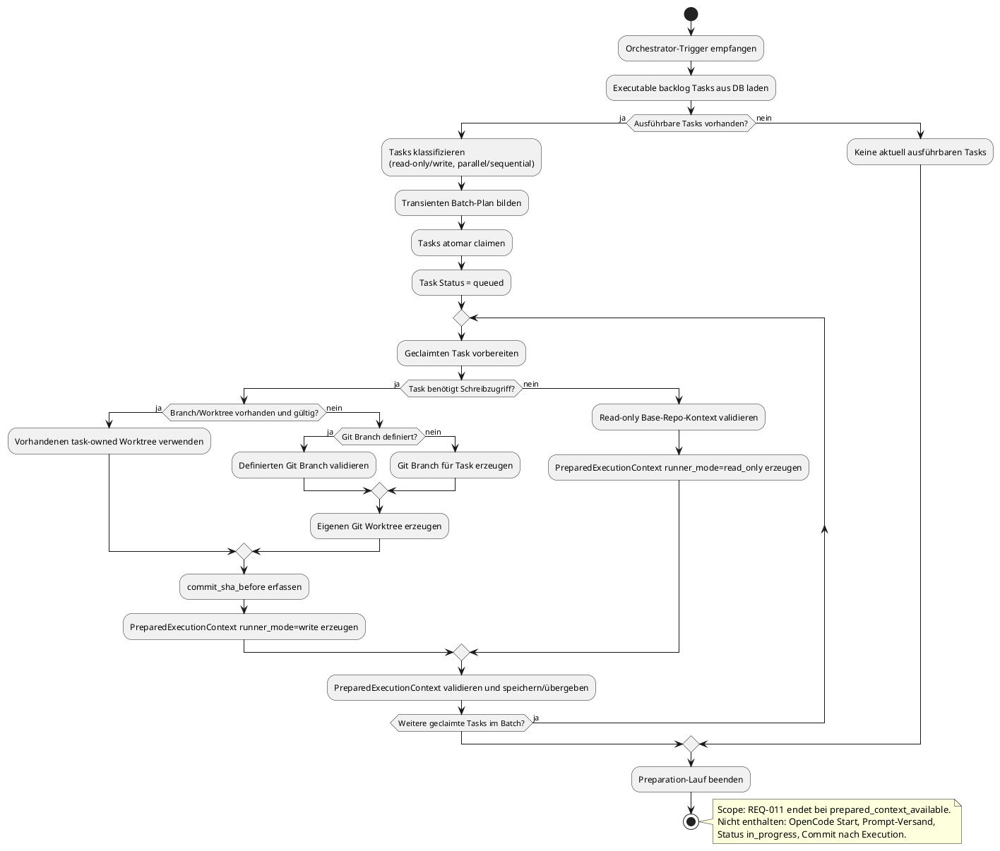

# ExecQueue – REQ-011 Orchestrator Execution Preparation

## Übersicht

REQ-011 implementiert die **Orchestrator Execution Preparation** Phase. Dieser Bereich deckt den gesamten Vorbereitungslauf ab, von der Entdeckung ausführbarer Tasks bis zum stabilen Handoff eines `PreparedExecutionContext` für die nachgelagerte Execution-Phase.

### Scope-Grenze

**In REQ-011 enthalten:**
- `backlog -> queued` (atomar geclaimt)
- Klassifikation (read-only/write, parallel/sequential)
- Batch Planning
- Git Branch/Worktree Vorbereitung (für Write-Tasks)
- `PreparedExecutionContext` Erzeugung
- `queued -> prepared` (Context verfügbar)

**NICHT in REQ-011 enthalten:**
- OpenCode Serve Session Start
- Prompt-Versand
- `queued/prepared -> in_progress`
- Commit nach Ausführung
- Merge/Review

Diese nachgelagerte Execution-Phase ist Gegenstand separater Requirements.

## Statusmodell

```
backlog -> queued -> prepared -> (execution phase: in_progress -> review/done/failed)
                  |
                  v
                failed (bei non-recoverable Fehler oder Retry Exhaustion)
```

### Status-Semantik

| Status | Bedeutung |
|--------|-----------|
| `backlog` | Task wartet auf Discovery |
| `queued` | Task wurde atomar geclaimt und ist für Preparation reserviert |
| `prepared` | Context ist vorbereitet und für Handoff bereit |
| `failed` | Preparation ist endgültig gescheitert |

### Verbotene Übergänge in REQ-011

- `queued -> in_progress` (gehört in Execution-Phase)
- `queued -> review`
- `queued -> done`

## Architektur

### Komponenten

```
┌─────────────────────────────────────────────────────────────────┐
│                    REQ-011 Orchestrator                         │
├─────────────────────────────────────────────────────────────────┤
│                                                                 │
│  1. Candidate Discovery                                         │
│     - Lädt executable backlog Tasks aus DB                      │
│     - Deterministische Sortierung                               │
│     - Dependency/Blocking Filter                                │
│                                                                 │
│  2. Task Classification                                         │
│     - read-only vs write                                        │
│     - parallel vs sequential                                    │
│     - Conflict Key Bestimmung                                   │
│                                                                 │
│  3. Batch Planning                                              │
│     - Transienter Batch-Plan                                    │
│     - Batch-Typen: readonly_parallel, write_parallel_isolated,  │
│                    write_sequential                             │
│                                                                 │
│  4. Atomic Locking                                              │
│     - backlog -> queued (atomar)                                │
│     - affected-row validation                                   │
│     - Conflict Handling (Requery/Abort)                         │
│                                                                 │
│  5. Git Context Preparation (nur Write-Tasks)                   │
│     - Branch-Naming: execqueue/task-{number}-{short_id}         │
│     - Worktree-Erzeugung/Reuse                                  │
│     - commit_sha_before Erfassung                               │
│                                                                 │
│  6. Context Contract Builder                                    │
│     - PreparedExecutionContext.v1                               │
│     - Read-only/Write Builder                                   │
│     - Validierung & Secret Guard                                │
│                                                                 │
└─────────────────────────────────────────────────────────────────┘
```

### Datenfluss

```
backlog Tasks (DB)
    │
    ▼
┌──────────────────┐
│ Candidate        │
│ Discovery        │
└────────┬─────────┘
         │
         ▼
┌──────────────────┐
│ Task             │
│ Classification   │
└────────┬─────────┘
         │
         ▼
┌──────────────────┐
│ Batch            │
│ Planning         │
└────────┬─────────┘
         │
         ▼
┌──────────────────┐
│ Atomic Locking   │
│ (backlog->queued)│
└────────┬─────────┘
         │
         ▼
    ┌───┴───┐
    │Write? │
    └───┬───┘
        │
    ┌───┴───────┐
    │ja         │nein
    ▼           ▼
┌─────────┐ ┌──────────────┐
│Git      │ │Read-only     │
│Context  │ │Context       │
│Prep     │ │Validation    │
└────┬────┘ └──────┬───────┘
     │             │
     └──────┬──────┘
            │
            ▼
┌──────────────────┐
│ Context          │
│ Contract Builder │
└────────┬─────────┘
         │
         ▼
PreparedExecutionContext.v1
         │
         ▼
    (Handoff to
 Execution Phase)
```

## Batch-Typen

### 1. readonly_parallel
- Mehrere Read-only Tasks
- Keine Konflikte
- Parallel ausführbar

### 2. write_parallel_isolated
- Mehrere Write-Tasks
- Jeder Task hat eigenen isolierten Branch/Worktree
- Keine gemeinsamen mutable State

### 3. write_sequential
- Single Write-Task oder
- Serialisierte Konfliktgruppe (gleiche Branch)
- Muss sequentiell ausgeführt werden

## Recovery-Matrix

| Zustand | Beispiel | Zielstatus | Bedingung |
|---------|----------|------------|-----------|
| Recoverable ohne Side Effects | temporärer DB-/Config-/Git-Read-Fehler | `backlog` | attempt < max |
| Recoverable mit task-owned Side Effects | Worktree teilweise erzeugt, task-owned | `backlog` oder `failed` | nur nach safe cleanup |
| Conflict | Branch/Worktree von anderem Task belegt | `backlog` | abhängig von Retry-Policy |
| Non-recoverable | invalider Pfad, ungültige Branch, Security Guard verletzt | `failed` | sofort |
| Retry exhausted | wiederholte recoverable Fehler | `failed` | attempt >= max |
| `in_progress` | Runner läuft oder lief an | keine Änderung | außerhalb REQ-011 |

## PreparedExecutionContext.v1

### Schema

```json
{
  "version": "v1",
  "task_id": "uuid",
  "task_number": 123,
  "task_type": "execution",
  "requires_write_access": true,
  "parallelization_mode": "sequential",
  "runner_mode": "write",
  "base_repo_path": "/path/to/repo",
  "branch_name": "execqueue/task-123-abc123",
  "worktree_path": "/tmp/execqueue/worktrees/task-123-abc123",
  "commit_sha_before": "abc123def456",
  "correlation_id": "prep-abc123",
  "batch_id": "batch-2026-04-28-abc123",
  "prepared_at": "2026-04-28T12:00:00Z"
}
```

### Validierungsregeln

- `runner_mode = write` erfordert `branch_name`, `worktree_path`, `commit_sha_before`
- `runner_mode = read_only` darf keine Branch-/Worktree-Erzeugung auslösen
- `base_repo_path` muss validiert sein
- Kontext darf keine Tokens, Secrets oder Provider-Keys enthalten

## Observability

### Strukturierte Log-Events

| Event | Felder |
|-------|--------|
| `task_discovered` | task_id, task_number, task_type, correlation_id |
| `task_classified` | task_id, task_number, runner_mode, batch_id |
| `task_locked` | task_id, task_number, batch_id, worker_id |
| `context_prepared` | task_id, task_number, runner_mode, branch_name, worktree_path, batch_id |
| `preparation_failed` | task_id, task_number, error_code, error_class, status_to |
| `recovery_executed` | task_id, task_number, status_from, status_to, reason |

## PlantUML Flow



## Dateistruktur

```
execqueue/orchestrator/
├── __init__.py           # Module exports
├── models.py             # DTOs: TaskClassification, BatchPlan, PreparedExecutionContext
├── candidate_discovery.py # Candidate Discovery
├── classification.py      # TaskClassifier, BatchPlanner
├── locking.py            # TaskLocker (atomic backlog->queued)
├── git_context.py        # GitContextPreparer (Branch/Worktree)
├── context_contract.py   # PreparedContextBuilder
├── main.py               # Orchestrator (main coordination)
├── recovery.py           # StaleQueuedRecovery, PreparationErrorClassifier
└── observability.py      # StructuredLogger, E2EValidator

tests/
└── test_req011_e2e.py    # E2E tests with negative assertions
```

## Tests

### Ausführen

```bash
pytest tests/test_req011_e2e.py -v
```

### Negative Assertions

Die Tests validieren explizit, dass:
- Kein OpenCode Session gestartet wird
- Kein Prompt dispatched wird
- Kein Status `in_progress` gesetzt wird
- Kein Commit nach Execution erzeugt wird

## Konfiguration

### Umgebungsvariablen

```bash
# Worktree root directory
WORKTREE_ROOT=/tmp/execqueue/worktrees

# Base repository path
BASE_REPO_PATH=/path/to/repo

# Max batch size
MAX_BATCH_SIZE=10

# Stale timeout (minutes)
STALE_TIMEOUT_MINUTES=30

# Max preparation attempts
MAX_PREPARATION_ATTEMPTS=3
```

## Nächste Schritte

REQ-011 ist abgeschlossen mit dem Handoff von `PreparedExecutionContext`. Die nachgelagerte Execution-Phase sollte als eigenes Requirement implementiert werden:

- OpenCode Serve Session Lifecycle
- Prompt Dispatch
- Event Streaming
- Runner Heartbeats
- Commit/Review
- Ergebnisverarbeitung
