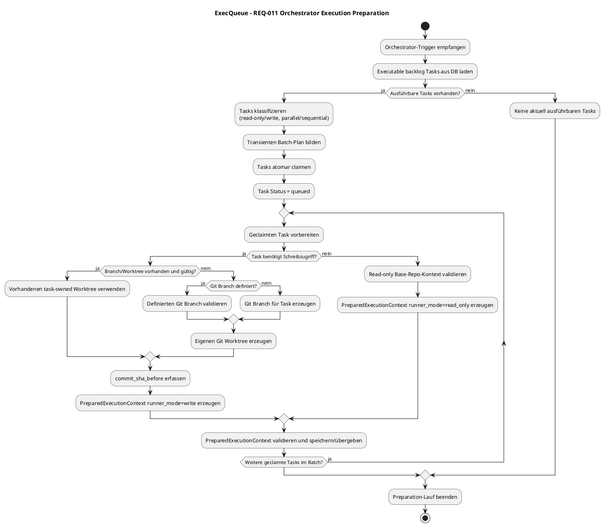

# 09 — Flow Alignment and Documentation Update

## Ziel
Den PlantUML-Flow und die technische Dokumentation auf die geschärfte REQ-011-Scope-Grenze ausrichten.

## Aufwand
Ca. 1–2h

## Scope
Enthalten:
- Flow-Diagramm an REQ-011 anpassen.
- Abgrenzung zur nachgelagerten Execution-Phase dokumentieren.
- Status-/Batch-/Recovery-Semantik konsolidieren.

Nicht enthalten:
- Produktivcode.
- Neue Runtime-Features.
- Execution-Runner-Implementierung.

## Problem im aktuellen Flow
Der aktuelle PUML-Flow enthält nach der Preparation bereits:
- `Task Execution erzeugen`
- `Execution Runner erzeugen`
- `OpenCode Serve Session starten`
- `Task Prompt versenden`
- `Task Status = in_progress`
- Execution-Ergebnis-/Commit-/Review-Logik

Das vermischt zwei Requirements:
1. REQ-011: Orchestrator Execution Preparation.
2. Nachgelagerte Execution: Runner/OpenCode Session Lifecycle und Task-Ausführung.

## Ziel-Flow für REQ-011

## Akzeptanzkriterien
- Dokumentation beschreibt `queued` eindeutig als claimed/prepared, nicht als laufend.
- Flow enthält keinen OpenCode-Start.
- Flow enthält keinen Prompt-Versand.
- Flow enthält keinen Statuswechsel nach `in_progress`.
- Flow verweist auf separates Requirement für Execution Runtime.

## Modellrouting
`[QWN]` — dokumentationsnah, geringe technische Unsicherheit.
